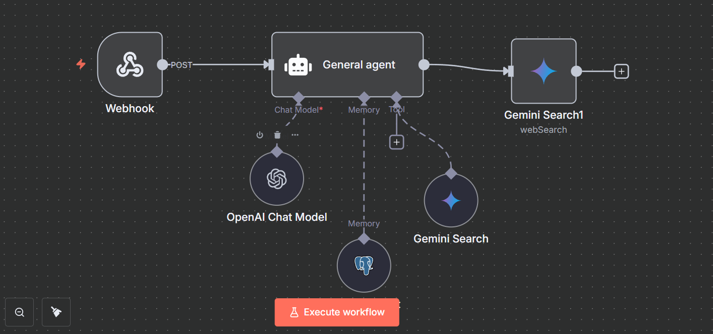
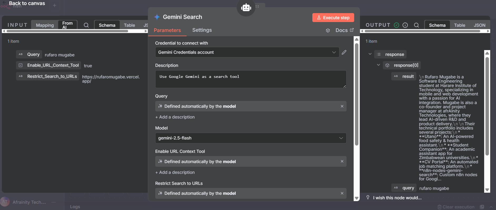

# n8n-nodes-gemini-search

This is an n8n community node package that provides nodes to interact with Google's Gemini AI models for search and content generation capabilities.

 


## Features

- **Gemini Search Node**: A comprehensive node that can perform web searches and generate content using Google's Gemini models
- **Gemini Search Tool**: A simplified tool version optimized for quick searches with Google Gemini
- **Smart URL Context**: Enable URL context to analyze specific websites with intelligent tool selection
- **Organization Context**: Provide company or domain-specific context for more relevant results
- **Multiple Model Support**: Choose from various Gemini models including latest versions (1.0 Pro, 1.5 Pro, 2.0 Flash, 2.0 Pro, 2.5 Pro)
- **Intelligent Tool Selection**: Automatically uses the right search tool based on your configuration
- **Progressive UI**: Clean interface with conditional fields that appear only when needed

## Installation

### In n8n Desktop

1. Go to Settings > Community Nodes
2. Select "Install"
3. Enter `n8n-nodes-gemini-search` in the "npm package name" field
4. Click "Install"

### In n8n Cloud

Use the Community Nodes feature to add this node to your cloud instance.

## Visual Guide

The screenshots below show the actual node interfaces in n8n. Each screenshot demonstrates different configurations and features:

- **Main Configuration**: Default state with all toggles OFF
- **Feature Enabled**: Shows how fields appear when toggles are turned ON
- **Advanced Options**: Expanded view of all available settings

> **Note**: Screenshots are located in the `docs/screenshots/` directory. See the [Screenshots Guide](docs/screenshots/README.md) for instructions on taking and updating these images.

## Usage

### Gemini Search Node

This node offers two operations:

1. **Web Search**: Performs a web search using Gemini's capabilities
2. **Generate Content**: Generates content using Gemini without web search

#### Screenshots

**Main Configuration:**


#### Configuration Options:

- **API Key**: Google Gemini API key (required)
- **Model**: Select from available Gemini models
- **Prompt/Query**: Your search query or content generation prompt
- **Enable URL Context Tool**: Toggle to enable URL-specific search (default: OFF)
- **Restrict Search to URLs**: Limit search to specific websites (only shown when URL Context is enabled)
- **Enable Organization Context**: Toggle to enable organization-specific search (default: OFF)
- **Organization Context**: Company or domain context (only shown when Organization Context is enabled)
- **System Instruction**: Custom instructions to guide the AI behavior
- **Advanced Options**:
  - Temperature: Control response randomness (0.0-1.0)
  - Max Output Tokens: Limit response length
  - Top P/Top K: Fine-tune token selection
  - Extract Source URL: Retrieve source URLs for search results

### Gemini Search Tool

This is a simplified version focused on search, optimized for use as an n8n tool:

#### Screenshots

**With URL Context Enabled:**


- **Query**: Enter your search query
- **Model**: Select from available Gemini models
- **Enable URL Context Tool**: Toggle to enable URL-specific search (default: OFF)
- **Restrict Search to URLs**: Limit search to specific websites (only shown when URL Context is enabled)
- **Enable Organization Context**: Toggle to enable organization-specific search (default: OFF)
- **Organization Context**: Company or domain context (only shown when Organization Context is enabled)
- **Options**:
  - Temperature: Control response randomness
  - Max Output Tokens: Limit response length
  - Custom System Instruction: Override default instructions
  - Return Full Response: Include complete API response data
  - Extract Source URL: Retrieve source URLs

## Smart Tool Selection

The nodes intelligently select the appropriate search tool based on your configuration:

### When URL Context is Enabled:
- **Tool Used**: `urlContext` - Analyzes content from specific URLs
- **Behavior**: Appends URLs to your query for targeted research
- **Best For**: Researching specific websites, documentation, or articles

### When URL Context is Disabled:
- **Tool Used**: `googleSearch` - General web search
- **Behavior**: Performs broad web searches across the internet
- **Best For**: General information gathering, current events, broad topics

## Example Workflows

### Basic Search

1. Create a new workflow
2. Add a "Gemini Search Tool" node
3. Configure your API credentials
4. Enter a search query
5. Execute and view the search results

### URL-Specific Research

1. Create a new workflow
2. Add a "Gemini Search" node
3. Set operation to "Web Search"
4. Enable "URL Context Tool"
5. Add specific URLs in "Restrict Search to URLs" (e.g., `docs.example.com,api.example.com`)
6. Enter your research query
7. Execute to get targeted results from those specific sites

### Organization-Focused Search

1. Create a new workflow
2. Add a "Gemini Search Tool" node
3. Enable "Organization Context"
4. Enter organization name (e.g., "OpenAI", "Google", "Microsoft")
5. Enter your search query
6. Execute to get results focused on that organization

### Advanced Content Generation

1. Create a new workflow
2. Add a "Gemini Search" node
3. Set operation to "Generate Content"
4. Configure model and prompt
5. Adjust temperature and token settings as needed
6. Execute to generate AI content

## Using as a Tool

This node can be used as a tool in n8n AI Agents. To enable community nodes as tools, you need to set the `N8N_COMMUNITY_PACKAGES_ALLOW_TOOL_USAGE` environment variable to `true`.

### Setting the Environment Variable

#### Bash/Zsh Shell

```bash
export N8N_COMMUNITY_PACKAGES_ALLOW_TOOL_USAGE=true
n8n start
```

#### Docker (docker-compose.yml)

```yaml
environment:
  - N8N_COMMUNITY_PACKAGES_ALLOW_TOOL_USAGE=true
```

#### Desktop App

Create a `.env` file in the n8n directory:

```
N8N_COMMUNITY_PACKAGES_ALLOW_TOOL_USAGE=true
```

#### Permanent Setting (Mac/Linux)

Add to your `~/.zshrc` or `~/.bash_profile`:

```bash
export N8N_COMMUNITY_PACKAGES_ALLOW_TOOL_USAGE=true
```

## Credentials

This node requires a Google Gemini API key. You can get one from the [Google AI Studio](https://ai.google.dev/).

## Changelog

### v1.1.16 - Major UI/UX Improvements

**Key Updates:**

- **🎛️ Smart Toggle System**: Added enable/disable toggles for both URL Context and Organization Context
- **🎯 Progressive UI**: Input fields now appear conditionally based on toggle states
- **🔧 Intelligent Tool Selection**: Automatically uses `urlContext` when URLs are provided, `googleSearch` otherwise
- **🎨 Consistent Interface**: Both nodes now have identical UI structure and behavior
- **🐛 Bug Fixes**: Resolved "Rufaro Mugabe" error by fixing URL context logic
- **📝 Clean Defaults**: Both context features are disabled by default for cleaner experience

### v1.1.15 - URL Context Implementation

**Key Updates:**

- **🌐 URL Context Tool**: Leverages Gemini's capability to analyze content from specific URLs
- **🔗 Smart URL Handling**: URLs are appended to user queries instead of system instructions
- **⚡ Dynamic Model Loading**: Models are fetched directly from the Gemini API
- **🛠️ Tool Optimization**: Prevents tool conflicts by using appropriate search method

### v1.1.10 - Foundation Updates

**Key Updates:**

- **🔄 Dynamic Model Loading**: Models are now fetched directly from the Gemini API
- **🌐 URL Context Tool**: Initial implementation of Gemini's URL analysis capability
- **🔧 Code Quality**: Fixed linting issues and improved code structure

## Support

For issues or feature requests, please [open an issue](https://github.com/rufaromugabe/n8n-nodes-gemini-search/issues) on GitHub.

## License

[MIT](LICENSE)